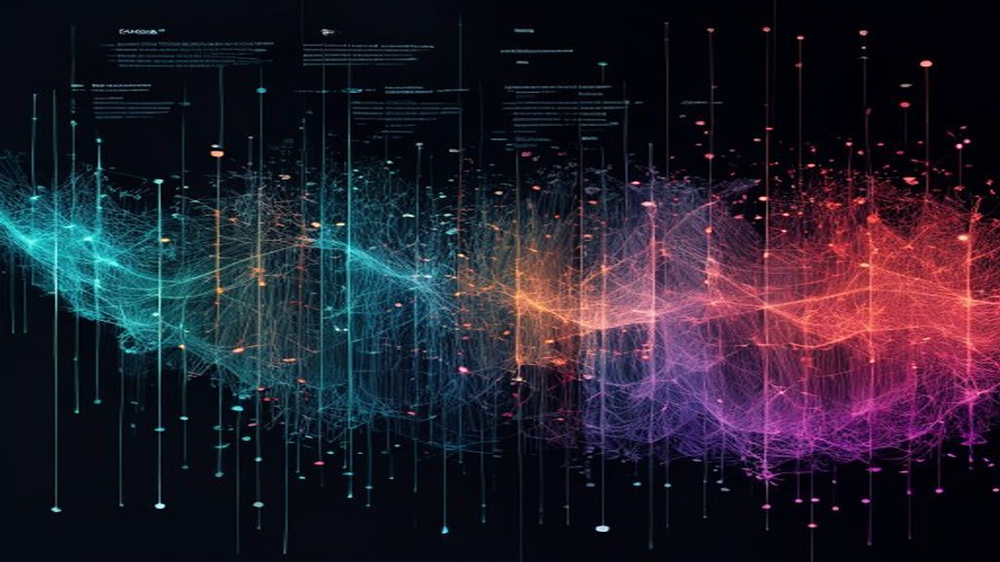

# Signal Loom



> **Weave evidence into a visual story without cutting the provenance threads.**

Signal Loom is an artifact-first visual-story production studio. It transforms supplied material into a coherent, inspectable story and real working artifacts while preserving the relationship between sources, claims, narrative, representation, interaction, distribution, review, and human authority in a resumable **Loomfile**.

**[Open the project site →](https://stunspot.github.io/signal-loom/)**

This repository contains the curated contest skill shipped with **Nova during OpenAI Build Week**, copied into a clean standalone public history. Private development history is excluded.

- Contest edition: `1.0.0`
- Skill: [`SKILL.md`](SKILL.md)
- Operating doctrine: [`knowledge/operating-doctrine.md`](knowledge/operating-doctrine.md)
- License: [MIT](LICENSE.md)

This is a standalone source link. Independent plugin installation is not claimed by the contest evidence.

## Start with evidence, audience, and the desired change

```text
Use $signal-loom to turn these supplied materials into a coherent web visual
story. Create a new Loomfile; inventory sources and claim status; build a
five-to-nine-beat spine; choose prose, diagram, chart, interaction, or omission
according to what each claim earns; build semantic responsive HTML with
important meaning available without JavaScript; run the available validators;
and report unresolved evidence, exact checks, human approvals, and the safest
next action. Do not publish.
```

When a request is underspecified, Signal Loom defaults conservatively to a web infographic, no publication, no currentness claims beyond supplied evidence, and a diagnostic record.

## Preserve the causal spine

Signal Loom keeps one chain intact:

```text
source → claim → story → representation → interaction → distribution → review
```

Narrative comes before style. Forms carry only earned claims. Interaction must teach. Human authority remains explicit. A finished image that cannot explain where its claims came from is not a successful artifact.

## The seven-stage loop

| Stage | Governing work | Durable state |
|---|---|---|
| **ORIENT** | Inventory supplied material, source authority, hashes, assertions, measurements, calculations, illustrative values, missing evidence, claim status, and currentness. | `sources/manifest.json`, `state/brief.json`, `state/claims.jsonl` |
| **SHAPE** | Build a five-to-nine-beat story with pulse, tension, turn, payoff, and faithful hooks. | `state/spine.json` |
| **PLAN** | Choose prose, diagram, chart, interaction, or omission; record consequential rejected representations and semantic structure. | `state/visual-plan.json` |
| **BUILD** | Create semantic, responsive web artifacts with meaningful headings, text equivalents, local assets, and no required external runtime. | `output/web/` |
| **FINISH** | Refine theme, typography, labels, microcopy, and only those interactions that improve comprehension. | `state/theme.tokens.json`, `state/interactions.json` |
| **DISTRIBUTE** | When requested, reconstruct the same meaning for carousel or platform physics instead of slicing up the web page. | `output/carousel/`, `output/platforms/`, `state/distribution.json` |
| **VERIFY** | Challenge claim linkage, currentness, representation, semantic structure, mobile intent, alt coverage, fallback, metadata, and package completeness. | `review/` |

The system may route among specialized faculties internally, but the user should experience one studio loop rather than a prompt menu.

## The Loomfile

The Loomfile is canonical project state, not an incidental export folder. It makes visual work resumable, reviewable, and transferable.

Typical custody includes:

- `sources/` — original material, manifest, source authority, locators, hashes, and currentness;
- `state/brief.json` — audience, desired understanding or action, outputs, platform, brand, time, format, and accessibility constraints;
- `state/claims.jsonl` — claim text, type, source, locator, as-of, currentness, status, and notes;
- `state/spine.json` — narrative beats and evidence links;
- `state/visual-plan.json` — representation choices, rejected forms, semantics, components, and alternatives;
- `state/decisions.jsonl` — consequential judgments, rationale, evidence, alternatives, authority, and stage;
- `output/` — built artifacts and explicitly requested platform reconstructions;
- `review/` — static findings, reviewer findings, evidence gaps, and corrections;
- `checkpoints/snapshots/` — material state before consequential edits to reviewed work.

Keep these states independent:

- `stage`: `intake`, `spined`, `planned`, `built`, `reviewed`, `approved_for_export`;
- `authority_status`: `draft`, `reviewed`, `approved`;
- `publication_status`: always `manual_only` in this product.

Built is not reviewed. Reviewed is not approved. Approved for export is not published.

## Claim and currentness discipline

Each consequential claim carries a source identifier and locator when sourced, as-of information when relevant, a currentness class, and one status:

| Status | Meaning |
|---|---|
| `sourced` | Directly supported by a supplied source and locator. |
| `inferred` | Reasoned from sourced material but not directly stated. |
| `illustrative` | Invented and visibly labeled to demonstrate form or logic. |
| `missing` | Required support was not supplied. |
| `stale` | Evidence exists but is too old for the intended current claim. |
| `disputed` | Supplied sources conflict or an authoritative challenge remains unresolved. |

Do not use `inferred`, `illustrative`, `missing`, `stale`, or `disputed` claims as unqualified factual copy.

Currentness is classified as `timeless`, `dated`, or `current-sensitive`. It belongs to the claim, not the file modification date. An old source may support a timeless claim; a recently copied file may contain stale facts.

## Choose the form the claim earns

| Form | Use it for |
|---|---|
| **Prose** | Nuance, caveats, definitions, uncertainty, or claims without stable structure or comparable numbers. |
| **Diagram** | Process, hierarchy, causality, relationship, topology, sequence, or system behavior. |
| **Chart** | Comparable quantitative values with known units, denominator, population, period, and defensible aggregation. |
| **Interaction** | A reader action that exposes a meaningful comparison, layer, sequence, or consequence. |
| **Omission** | Material that cannot support the story or its evidence contract. |

Do not fabricate numbers to justify a chart. Do not turn every number into a chart or every concept into a diagram. Representation is an editorial claim about what matters.

## Chart integrity

Record and visibly preserve:

- measurement and unit;
- population, denominator, and time period;
- categories and ordering;
- baseline and axis domain;
- aggregation and transformation;
- missing values and exclusions;
- uncertainty or estimate status;
- source and as-of date.

Length encodings such as bars normally require a zero baseline. If a nonzero baseline is analytically necessary, disclose it prominently. Do not use area or volume for one-dimensional data unless the encoding is normalized and explained.

Illustrative values may demonstrate layout or interaction only when labeled in the visible artifact, claim ledger, and review record. They never migrate into sourced or publish-ready status.

## Build and distribute honestly

A normal web artifact lives under `output/web/` and uses semantic HTML, responsive layout, meaningful headings, accessible text equivalents, local or embedded assets, and no required external runtime. Important meaning remains available without JavaScript.

Platform output is a native reconstruction. Preserve the claim set, source meaning, uncertainty, and causal order while recomposing density, rhythm, safe zones, calls to action, and platform behavior. Do not crop or resize a long web artifact into carousel panels and call it strategy.

## Verify the artifact

Use the deterministic tools when Python is available:

```shell
python scripts/validate_loomfile.py <loomfile>
python scripts/inspect_infographic_html.py <path-to-index.html>
python scripts/package_loomfile.py <loomfile>
```

Static inspection is a guardrail. It does not prove sanitization, browser rendering, accessibility conformance, security, professional fitness, or audience success.

Use precise evidence language:

- “static checks passed,” not “secure”;
- “semantic structure was inspected,” not “accessible”;
- “source-linked within supplied materials,” not “fact checked”;
- “formatted for the stated platform constraints,” not “will perform”;
- “approved for export” only when human authority is recorded;
- never “published” without direct evidence of the separate action.

## Degraded routes

- **No assets:** build typography-first.
- **Missing quantitative data:** use prose or a diagram, not an invented chart.
- **Stale claims:** flag or exclude them from current publish-ready copy.
- **No Python or filesystem:** provide complete copy-ready files and mark deterministic checks unexecuted.
- **Tool failure:** preserve completed state, record the failure, and name the exact re-entry condition.
- **Cumulative degradation:** stop at a reviewable story spine and visual plan rather than calling fragments complete.

## Repository map

- [`SKILL.md`](SKILL.md) — complete Signal Loom operating contract;
- [`knowledge/operating-doctrine.md`](knowledge/operating-doctrine.md) — governing priorities, Loomfile invariant, evidence language, and studio voice;
- [`knowledge/claim-and-currentness-doctrine.md`](knowledge/claim-and-currentness-doctrine.md) — claim statuses, freshness classes, and human authority;
- [`knowledge/representation-and-chart-integrity.md`](knowledge/representation-and-chart-integrity.md) — earned forms, chart checks, illustrative data, and platform reconstruction;
- [`knowledge/infographic-toolkit-v2-canonical.md`](knowledge/infographic-toolkit-v2-canonical.md) — canonical story, hook, forge, review, theme, interaction, and distribution intelligence;
- [`assets/semantic-infographic.template.html`](assets/semantic-infographic.template.html) — implementation shape;
- [`scripts/`](scripts/) — Loomfile initialization, validation, HTML inspection, and packaging;
- [`fallbacks/`](fallbacks/) — universal copy-paste and degraded-capability routes;
- [`docs/`](docs/) — tailored static project site and generated raster artwork;
- [`docs/SITE-SOURCE.md`](docs/SITE-SOURCE.md) — site claims, source custody, deployment, and review boundary;
- [`.github/workflows/deploy-pages.yml`](.github/workflows/deploy-pages.yml) — official GitHub Pages deployment workflow.

## Authority and trust boundaries

Signal Loom can classify, structure, build, inspect, and recommend. It does not invent data, execute imported code merely to inspect it, conceal review findings, send private material elsewhere without authority, approve its own artifact, publish, post, host, log into accounts, or buy media.

Only the human can approve disputed resolution, authorize externally refreshed evidence, approve export, or authorize publication.

## Source lineage

The public contest source remains available in [Nova the Optimal AI + MIND](https://github.com/Stunspot/nova-the-optimal-ai-mind/tree/e42dd11646bc548b9ac29d6f700370365ee68986/plugins/nova-the-optimal-ai/skills/signal-loom). This standalone repository packages that curated edition under the MIT License.
