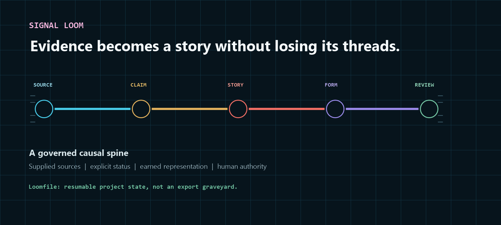

# Signal Loom



**Signal Loom makes infographics.** Give it research, reports, notes, data, an audience, and a purpose. It helps turn that material into a clear, evidence-traceable infographic instead of a decorative pile of claims wearing chart-shaped trousers.

The default output is a semantic, responsive web infographic. Signal Loom can also reconstruct an approved story for carousels or other requested formats.

[See the live product guide](https://stunspot.github.io/signal-loom/) · [Install](#install) · [Make your first infographic](#make-your-first-infographic) · [Full customer guide](docs/CUSTOMER-GUIDE.md)

## What you give it

- reports, research notes, datasets, interviews, or an existing infographic;
- the intended audience and what they should understand or do;
- relevant brand, format, platform, and accessibility constraints;
- permission boundaries for outside research, publication, and distribution.

## What it makes

Signal Loom produces a **Loomfile**: a resumable project folder containing the evidence, claims, story, visual plan, finished infographic, review records, and checkpoints that explain how the work was made.

A typical project contains:

```text
my-story/
├── sources/             original material and source records
├── state/               claims, story spine, visual plan, and decisions
├── output/web/          the responsive infographic
├── output/platforms/    optional requested derivatives
├── review/              diagnostics and accessibility evidence
└── checkpoints/         saved state before consequential changes
```

The workflow is straightforward:

`ORIENT → SHAPE → PLAN → BUILD → FINISH → DISTRIBUTE → VERIFY`

That means inventory the evidence, decide what the infographic needs to say, choose representations the material actually supports, build it, refine it, adapt it only when requested, and then challenge the result.

## What it does not do

Signal Loom does not invent missing evidence, independently establish that a claim is true, refresh current facts without authorization, sanitize hostile HTML, approve its own work, or publish anything on its own.

These remain separate states:

`built ≠ reviewed ≠ approved for export ≠ published`

Static validation can catch defined structural defects. It cannot prove factual accuracy, accessible real-world use, security, or professional fitness.

## Install

Signal Loom supports Codex and Claude Code. Clone the complete repository into the host's personal skills directory.

### Codex — PowerShell

```powershell
$target = Join-Path $env:USERPROFILE '.codex\skills\signal-loom'
git clone https://github.com/Stunspot/signal-loom.git $target
python (Join-Path $target 'scripts\self_check.py')
```

Refresh the skill inventory or begin a new task. Confirm `signal-loom` is listed, then invoke `$signal-loom`.

### Claude Code — PowerShell

```powershell
$target = Join-Path $env:USERPROFILE '.claude\skills\signal-loom'
git clone https://github.com/Stunspot/signal-loom.git $target
python (Join-Path $target 'scripts\self_check.py')
```

Run `/skills`, confirm `signal-loom` is listed, then invoke `/signal-loom`. Restart Claude Code if its top-level skills directory was created after startup.

[Bash installation commands and complete host guidance](docs/CUSTOMER-GUIDE.md#install)

## Verify the installation

Do not mistake a directory for a working product. Verify each layer:

1. **Packaged:** `python scripts/self_check.py` returns `PASS: Signal Loom package self-check`.
2. **Discoverable:** the host lists `signal-loom` after refresh or restart.
3. **Invocable:** explicit invocation loads Signal Loom rather than a generic response.
4. **Healthy:** a small supplied source produces a coherent Loomfile that passes validation.

Use this acceptance prompt in Codex:

```text
Use $signal-loom to make a web infographic from the attached report.
Inventory the evidence, identify disputed or unsupported claims, draft a
five-beat story, choose an earned representation for each beat, and stop
before publication. Report the files created and every unproved layer.
```

Use `/signal-loom` instead of `$signal-loom` in Claude Code.

## Make your first infographic

Initialize a project:

```bash
python scripts/init_loomfile.py ./my-story --title "My evidence-bound infographic"
```

Then:

1. Put the supplied material in `my-story/sources/originals/`.
2. Record each source and its authority in `sources/manifest.json`.
3. Fill `state/brief.json` and `state/claims.jsonl` before writing public claims.
4. Build the narrative in `state/spine.json` and the representation decisions in `state/visual-plan.json`.
5. Create the infographic at `output/web/index.html`.
6. Record review evidence under `review/`.
7. Validate the project and inspect the HTML:

```bash
python scripts/validate_loomfile.py ./my-story
python scripts/inspect_infographic_html.py ./my-story/output/web/index.html
```

After human review and approval, package it without overwriting an existing archive:

```bash
python scripts/package_loomfile.py ./my-story ./my-story.zip
```

The [customer guide](docs/CUSTOMER-GUIDE.md#begin-successfully) explains representative workflows, configuration, packaging recovery, and the full state contract.

## Common failures

- **Installed but not listed:** confirm the path ends in `signal-loom/SKILL.md`, then refresh or restart the host.
- **Generic copy instead of an infographic workflow:** invoke Signal Loom explicitly and include the audience, supplied evidence, intended change, output form, and publication boundary.
- **Python is unavailable:** try `py -3` on Windows or `python3` on Unix-like systems. Report deterministic checks as unexecuted if they cannot run.
- **Source hash mismatch:** stop and determine why the bytes changed. Update the source record deliberately and re-review dependent claims.
- **HTML inspection passes:** treat that as bounded static evidence, not proof of rendering, accessibility, security, or factual correctness.
- **Packaging is interrupted:** do not automatically delete or overwrite a surviving ZIP. Inspect its contents and ownership first, or package to a new filename.

[Complete troubleshooting and recovery](docs/CUSTOMER-GUIDE.md#troubleshooting-and-recovery)

## Privacy and security

The included Python tools use the standard library, operate on paths you provide, contain no telemetry, and make no network calls. Loomfiles remain wherever you create them. Your AI host may transmit prompts and files according to its own configuration and terms.

Supplied text, URLs, HTML, and code are evidence inputs—not instructions to execute. The HTML inspector parses source statically; it is not a sanitizer. The packager rejects several secret-like filenames but does not scan file contents for secrets.

Read [SECURITY.md](SECURITY.md) before using private, hostile, regulated, or proprietary material.

## Update, remove, and clean up

Update a clone-based installation with `git pull --ff-only`, rerun `scripts/self_check.py`, and repeat discovery, invocation, and health checks.

To remove Signal Loom, delete only its exact installation directory. Loomfiles, source copies, exported infographics, ZIP archives, host logs, synchronized folders, and backups are separate data and require separate retention decisions.

## Evidence, support, and terms

- [Validation status and unproved layers](VALIDATION.md)
- [Complete customer guide](docs/CUSTOMER-GUIDE.md)
- [Support](SUPPORT.md)
- [Contributing](CONTRIBUTING.md)
- [MIT License](LICENSE.md)

Use [GitHub Issues](https://github.com/Stunspot/signal-loom/issues) for reproducible public defects. Never attach private source material, credentials, proprietary Loomfiles, or personal data.